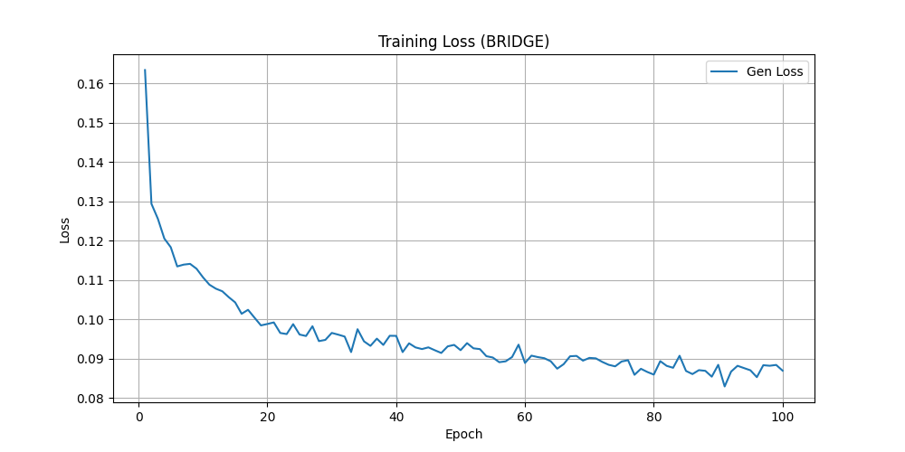
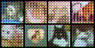
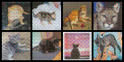

# Generative Models From Scratch 🚀

A from-scratch, custom PyTorch implementation of modern generative techniques including **Flow Matching**, **Schrödinger Bridges**, and **Generative Adversarial Networks (GANs)** powered by a generic Transformer-based core (`MicroDiT`). 

This repository explores the mathematics and dynamics of mapping pure noise distributions directly to complex data manifolds (like CIFAR-10) using precise velocity estimation and optimal transport structures.

## 🏗 Directory Structure & Code Explanation

* **`diffusion/model.py`**: The neural network architectures. Features a highly modular `MicroDiT` (Diffusion Transformer) network with class-conditioning and adaptive timesteps. Also houses a simple robust Conv2D `Discriminator` designed for stabilizing high-tension adversarial updates.
* **`diffusion/frameworks_flow.py`**: Implements Continuous Normalizing Flows using Eulerian steps combined dynamically with Sinkhorn Optimal Transport matrices for optimal distance convergence tracking.
* **`diffusion/frameworks_bridge.py`**: Executes the mathematics of Schrödinger Bridges, calculating and matching probability bounds strictly using Sinkhorn mappings to map between two arbitrary domains.
* **`diffusion/train.py`**: The fully unified training harness. Includes EMA (Exponential Moving Average) stabilization, `OneCycleLR` scheduling, TTUR (Two Time-Scale Update Rule), and hardware-agnostic device targeting (natively supports Apple Silicon `MPS`).
* **`diffusion/data.py`**: Lightweight custom data loaders configured perfectly for paired transitions during Bridge matching.

## 🚀 How to Start the Program

You can natively boot the model into any mathematically distinct paradigm securely from the root directory. 

First, ensure you have standard machine learning requirements installed (PyTorch, Torchvision, Matplotlib, tqdm):
```bash
pip install -r requirements.txt # Optional if configured
```

Then, launch the core training shell by executing:
```bash
python diffusion/train.py --mode gan
```

**Available Architecture Modes:**
* `--mode gan`: Engages Flow Matching governed via Adversarial constraints.
* `--mode flow`: Engages standard OT Flow Matching algorithms alone.
* `--mode bridge`: Boots into Schrödinger Bridge logic.

During runtime, the repository will automatically build a `/checkpoints` folder to safely store epoch states, and an `/outputs` directory to provide physical sample visualization logs updating every `5` epochs.

## 📸 Sample Gallery (Schrödinger Bridge Progression)

As the model learns to synthesize distributions, it tracks its optimal mapping progress. The learning progression is highly dynamic. 

Notice how the `loss_sb` (Sinkhorn optimal transport matching objective) decreases successfully over training, guided by mathematically balanced adversarial bounds.



### Generation Quality Over Time
Using the `bridge` engine, watch the progression of structural coherence from the first epoch up to convergence:

| Epoch 1 (Initial Mapping) | Epoch 15 (Structural Formulation) |
| :---: | :---: |
|  |  |
| **Epoch 50 (Sharpening Boundaries)** | **Epoch 100 (Reconstructed Samples)** |
|  |  |

### The Mathematics Behind the Adversarial Flow
* The models utilize a stable `0.5` momentum setup with perfectly balanced One-sided label smoothing targeted heavily to resist discriminator overconfidence.
* Both Gen/Disc architectures climb harmoniously via parallel schedulers enforcing strict TTUR (Two Time-Scale Update Rules) to anchor long-term adversarial equilibrium without mode collapse.

---
> *Developed entirely from scratch using PyTorch primitives.*
